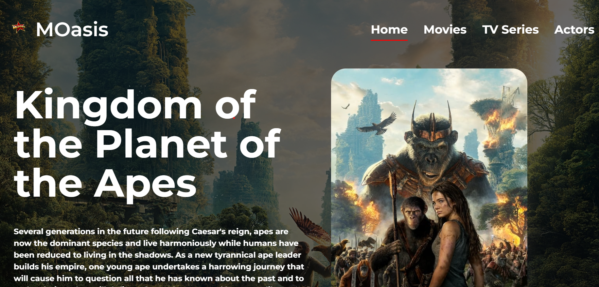

<h3><b>Welcome To Our First React Movie Project - MOasis</b></h3>

  
   

# 📗 Table of Contents

- [📗 Table of Contents](#-table-of-contents)
- [📖 React Group Project ](#-react-group-project-)
  - [🛠 Built With ](#-built-with-)
    - [Key Features ](#key-features-)
  - [🚀 Live Demo ](#-live-demo-)
  - [💻 Getting Started ](#-getting-started-)
    - [Prerequisites](#prerequisites)
    - [Setup](#setup)
    - [Install](#install)
    - [Usage](#usage)
    - [Run tests](#run-tests)
    - [Deployment](#deployment)
  - [👥 Authors ](#-authors-)
  - [🔭 Future Features ](#-future-features-)
  - [🤝 Contributing ](#-contributing-)
  - [⭐️ Show your support ](#️-show-your-support-)
  - [📝 License ](#-license-)

# 📖 React Group Project 

**React Group Project** is about building a web application based on an external API. We have selected an API that provides data about movie and series and then build the web app around it. The web app will have 2 or 3 user interfaces.

## 🛠 Built With 
- HTML
- CSS
- React
- Webpack
- Babel

### Key Features 

- **Watch trailers**
- **Reach out to developers on the footer**
- **Search through movies and tv shows**

(<a href="#readme-top">back to top</a>)

## 🚀 Live Demo 
- [SEE IT LIVE HERE!](https://t-p-s-movie.netlify.app/)

## 💻 Getting Started 

To get a local copy up and running, follow these steps.

### Prerequisites

In order to run this project you need:

npm init -y

### Setup

Clone this repository to your desired folder:

git clone https://github.com/202404-Y-ZA-FSW/movies-project-kgomotso-phumlani-sakhile.git

### Install

Install this project with:

npm install

### Usage

To run the project, execute the following command:

npm run build

### Run tests

To run tests, run the following command:

npm test

### Deployment

You can deploy this project using:

npm start

(<a href="#readme-top">back to top</a>)

## 👥 Authors 

👤 **Kgomotso (Troos) Nacane**

- GitHub: [Troos](https://github.com/Kgomotso196)
- LinkedIn: [Kgomotso Nacane](https://www.linkedin.com/in/kgomotso-nacane/)

👤 **Pumlani Kewana**

- GitHub: [Pumlani](https://github.com/Pumlanikewana)
- LinkedIn: [Pumlani Kewana](https://www.linkedin.com/in/pumlani-kewana-58047515b)

👤 **Sakhile Motha**

- GitHub: [Sakhile](https://github.com/KhileM)
- LinkedIn: [Sakhile Motha](https://www.linkedin.com/in/sakhile-motha-033264167/)

(<a href="#readme-top">back to top</a>)

## 🔭 Future Features 

- [ ] **Add reservations**
- [ ] **Add subscription**

(<a href="#readme-top">back to top</a>)

## 🤝 Contributing 

Contributions, issues, and feature requests are welcome!

Feel free to check the [issues here](https://github.com/202404-Y-ZA-FSW/movies-project-kgomotso-phumlani-sakhile/issues).

(<a href="#readme-top">back to top</a>)

## ⭐️ Show your support 

If you like this project please give us a STAR ⭐

(<a href="#readme-top">back to top</a>)

## 📝 License 

This project is [MIT](./MIT.md) licensed.
